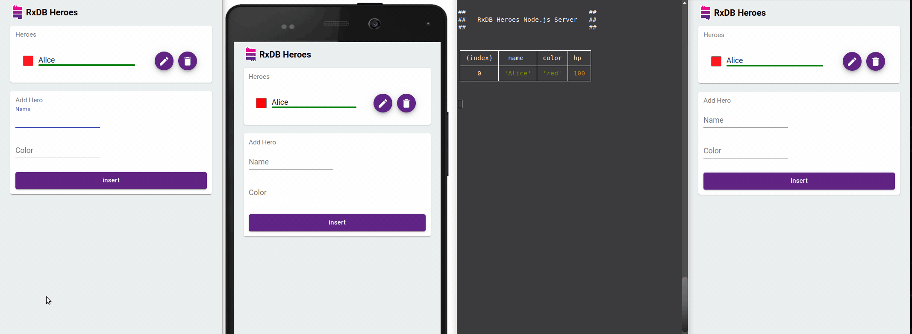
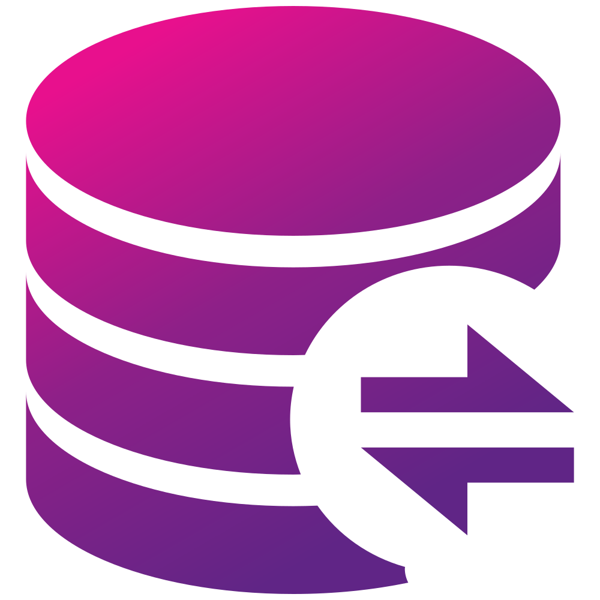
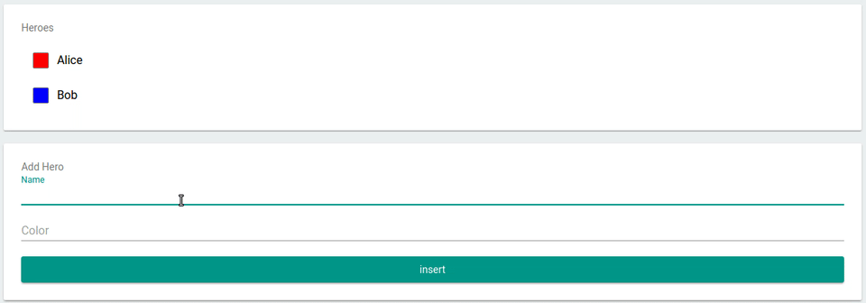
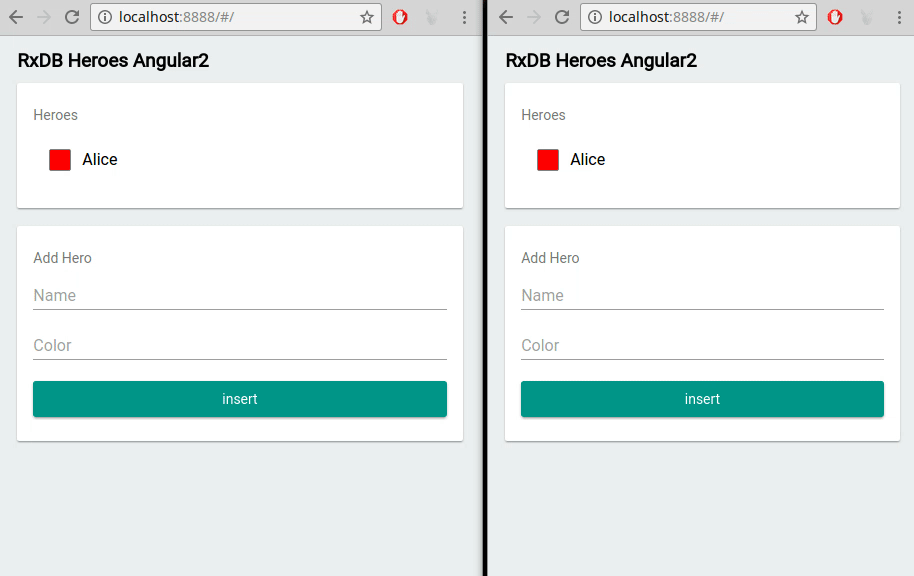

<!-- | Announcement                                                        |
| :--: |
| &emsp;&emsp;&emsp;&emsp;&emsp;&emsp;&emsp;&emsp;&emsp;&emsp;&emsp;&emsp; [Help testing the NxDB version 15 release](https://github.com/nxpkg/nxdb/issues/5155) &emsp;&emsp;&emsp;&emsp;&emsp;&emsp;&emsp;&emsp;&emsp;&emsp;&emsp;&emsp;&emsp;&emsp; | -->

<!--
| Announcement                                                        |
| :--: |
| &emsp;&emsp;&emsp;&emsp;&emsp;&emsp;&emsp;&emsp;&emsp;&emsp;&emsp;&emsp; Version **15.0.0** is now released, read the [CHANGELOG](https://nxpkg.github.io/releases/15.0.0.html) &emsp;&emsp;&emsp;&emsp;&emsp;&emsp;&emsp;&emsp;&emsp;&emsp;&emsp;&emsp;&emsp;&emsp; |
-->


<!--
| Announcement                                                        |
| :--: |
| Please take part in the [NxDB user survey 2023](https://nxpkg.github.io/survey.html). This will help me to better plan the steps for the next major release. (takes about 2 minutes)
-->

<br />


# NxDB


<p align="center">
    <a href="https://github.com/nxpkg/nxdb/releases"></a>
    &nbsp;
    <a href="https://nxpkg.github.io/tutorials/typescript.html"></a>
    &nbsp;
    <a href="https://github.com/nxpkg/nxdb/blob/master/LICENSE.txt"></a>
    &nbsp;
    <a href="https://github.com/nxpkg/nxdb/stargazers"></a>
    &nbsp;
    <a href="https://www.npmjs.com/package/nxdb"></a>   
</p>

<p align="center">
 	  <a href="https://nxpkg.github.io/chat"></a>
	  &nbsp;
    <a href="https://twitter.com/intent/follow?screen_name=nxdbjs"></a>
	  &nbsp;
    <a href="https://www.linkedin.com/company/nxdb"></a>
    &nbsp;
    <a href="https://nxpkg.github.io/newsletter"></a>
</p>


<br />

<h2>
  &nbsp;&nbsp;What is NxDB?
</h2>

<p align="justify">
  NxDB (short for <b>R</b>eactive <b>D</b>ata<b>b</b>ase) is a <a href="https://nxpkg.github.io/offline-first.html">local-first</a>, NoSQL-database for JavaScript Applications like Websites, hybrid Apps, Electron-Apps, Progressive Web Apps, Deno and <a href="https://nxpkg.github.io/nodejs-database.html">Node.js</a>.
  Reactive means that you can not only query the current state, but <b>subscribe</b> to all state changes like the result of a query or even a single field of a document.
  This is great for UI-based <b>realtime</b> applications in a way that makes it easy to develop and also has great performance benefits but can also be used to create fast backends in Node.js.<br />
  NxDB provides an easy to implement <a href="https://nxpkg.github.io/replication.html">protocol</a> for realtime <b>replication</b> with your existing infrastructure or one of the plugins for <a href="https://nxpkg.github.io/replication-http.html">HTTP</a>, <a href="https://nxpkg.github.io/replication-graphql.html">GraphQL</a>, <a href="https://nxpkg.github.io/replication-couchdb.html">CouchDB</a>, <a href="https://nxpkg.github.io/replication-websocket.html">Websocket</a>, <a href="https://nxpkg.github.io/replication-webrtc.html">WebRTC</a>, <a href="https://github.com/marceljuenemann/nxdb-supabase">Supabase</a>, <a href="https://nxpkg.github.io/replication-firestore.html">Firestore</a>, <a href="https://nxpkg.github.io/replication-nats.html">NATS</a>.<br />
  NxDB is based on a storage interface that enables you to swap out the underlying storage engine. This increases <b>code reuse</b> because you can use the same database code for different JavaScript environments by just switching out the storage settings.
</p>

Use the [quickstart](https://nxpkg.github.io/quickstart.html), read the [documentation](https://nxpkg.github.io/install.html) or explore the [example projects](https://github.com/nxpkg/nxdb/tree/master/examples).

<h2>
  &nbsp;&nbsp;Multiplayer realtime applications
  
</h2>





<h2>
  &nbsp;&nbsp;Replicate with your <b style="color: #e6008d;">existing infrastructure</b>
</h2>

NxDB provides an easy to implement, <b>battle-tested</b> <a href="https://nxpkg.github.io/replication.html"> replication protocol</a> for realtime sync with your existing infrastructure.<br />
There are also plugins to easily replicate with <a href="https://nxpkg.github.io/replication-graphql.html">GraphQL</a>, <a href="https://nxpkg.github.io/replication-couchdb.html">CouchDB</a>, <a href="https://nxpkg.github.io/replication-websocket.html">Websocket</a>, <a href="https://nxpkg.github.io/replication-webrtc.html">WebRTC</a>,<a href="https://github.com/marceljuenemann/nxdb-supabase">Supabase</a>, <a href="https://nxpkg.github.io/replication-firestore.html">Firestore</a> or <a href="https://nxpkg.github.io/replication-nats.html">NATS</a>.


<h2>
  &nbsp;&nbsp;<b style="color: #8D2089;">Flexible</b> storage layer
</h2>

NxDB is based on a [storage interface](https://nxpkg.github.io/rx-storage.html) that enables you to swap out the underlying storage engine. This increases **code reuse** because the same database code can be used in different JavaScript environments by just switching out the storage settings.

You can use NxDB on top of [IndexedDB](https://nxpkg.github.io/rx-storage-indexeddb.html), [OPFS](https://nxpkg.github.io/rx-storage-opfs.html), [LokiJS](https://nxpkg.github.io/rx-storage-lokijs.html), [Dexie.js](https://nxpkg.github.io/rx-storage-dexie.html), [in-memory](https://nxpkg.github.io/rx-storage-memory.html), [SQLite](https://nxpkg.github.io/rx-storage-sqlite.html), in a [WebWorker](https://nxpkg.github.io/rx-storage-worker.html) thread and even on top of [FoundationDB](https://nxpkg.github.io/rx-storage-foundationdb.html) and [DenoKV](https://nxpkg.github.io/rx-storage-denokv.html).

No matter what kind of runtime you have, as long as it runs JavaScript, it can run NxDB:

<h4>
  
  
  
  
  
  <a href="./examples/angular">Browsers</a>
  
  <a href="./examples/node">Node.js</a>
  
  <a href="https://nxpkg.github.io/react-native-database.html">React Native</a>
  
  <a href="https://nxpkg.github.io/capacitor-database.html">Capacitor</a>
  
  <a href="https://github.com/herefishyfish/nxdb-nativescript">NativeScript</a>
  
  <a href="./examples/flutter">Flutter</a>
  or as an 
  <a href="https://nxpkg.github.io/electron-database.html">Electron Database</a>
</h4>


<h2>
  &nbsp;&nbsp;Quick start
</h2>


#### Install

```sh
npm install nxdb rxjs --save
```

#### Store data

```javascript
import { 
  createRxDatabase
} from 'nxdb/plugins/core';

/**
 * For browsers, we use the dexie.js based storage
 * which stores data in IndexedDB in the browser.
 * In other JavaScript runtimes, we can use different storages:
 * @link https://nxpkg.github.io/rx-storage.html
 */
import { getRxStorageDexie } from 'nxdb/plugins/storage-dexie';

// create a database
const db = await createRxDatabase({
    name: 'heroesdb', // the name of the database
    storage: getRxStorageDexie()
});

// add collections
await db.addCollections({
  heroes: {
    schema: mySchema
  }
});

// insert a document
await db.heroes.insert({
  name: 'Bob',
  healthpoints: 100
});
```

#### Query data once
```javascript
const aliveHeroes = await db.heroes.find({
  selector: {
    healthpoints: {
      $gt: 0
    }
  }
}).exec(); // the exec() returns the result once
```

#### Observe a Query
```javascript
await db.heroes.find({
  selector: {
    healthpoints: {
      $gt: 0
    }
  }
})
.$ // the $ returns an observable that emits each time the result set of the query changes
.subscribe(aliveHeroes => console.dir(aliveHeroes));
```


Continue with the [quickstart here](https://nxpkg.github.io/quickstart.html).


<h2>
  &nbsp;&nbsp;More Features (click to toggle)
</h2>


<details>
<summary>
  <b>Subscribe to events, query results, documents and event single fields of a document</b>
  <p>

NxDB implements [rxjs](https://github.com/ReactiveX/rxjs) to make your data reactive.
This makes it easy to always show the real-time database-state in the dom without manually re-submitting your queries.
You can also add [custom reactiveness libraries](https://nxpkg.github.io/reactivity.html) like signals or other state management.</p>

</summary>

```javascript
db.heroes
  .find()
  .sort('name')
  .$ // <- returns observable of query
  .subscribe( docs => {
    myDomElement.innerHTML = docs
      .map(doc => '<li>' + doc.name + '</li>')
      .join();
  });
```



</details>

<details>
<summary>
  <b>MultiWindow/Tab</b>
  <p>

NxDB supports multi tab/window usage out of the box. When data is changed at one browser tab/window or Node.js process, the change will automatically be broadcasted to all other tabs so that they can update the UI properly.

</p>
</summary>



</details>

<details>
<summary>
  <b>EventReduce</b>
  <p>
    One big benefit of having a realtime database is that big performance optimizations can be done when the database knows a query is observed and the updated results are needed continuously. NxDB internally uses the <a href="https://github.com/nxpkg/event-reduce">Event-Reduce algorithm</a>. This makes sure that when you update/insert/remove documents,
    the query does not have to re-run over the whole database but the new results will be calculated from the events. This creates a huge performance-gain
    with zero cost.
  </p>
</summary>

### Use-Case-Example

Imagine you have a very big collection with many user-documents. At your page you want to display a toplist with users which have the most `points` and are currently logged in.
You create a query and subscribe to it.

```js
const query = usersCollection.find().where('loggedIn').eq(true).sort('points');
query.$.subscribe(users => {
    document.querySelector('body').innerHTML = users
        .reduce((prev, cur) => prev + cur.username+ '<br/>', '');
});
```

As you may detect, the query can take very long time to run, because you have thousands of users in the collection.
When a user now logs off, the whole query will re-run over the database which takes again very long.

```js
await anyUser.incrementalPatch({loggedIn: false});
```

But not with the EventReduce.
Now, when one user logs off, it will calculate the new results from the current results plus the RxChangeEvent. This often can be done in-memory without making IO-requests to the storage-engine. EventReduce not only works on subscribed queries, but also when you do multiple `.exec()`'s on the same query.

</details>

<details>
<summary>
  <b>Schema</b>
  <p>

Schemas are defined via [jsonschema](http://json-schema.org/) and are used to describe your data.</p>

</summary>

```javascript
const mySchema = {
    title: "hero schema",
    version: 0,                 // <- incremental version-number
    description: "describes a simple hero",
    primaryKey: 'name',         // <- 'name' is the primary key for the collection, it must be unique, required and of the type string 
    type: "object",
    properties: {
        name: {
            type: "string",
            maxLength: 30
        },
        secret: {
            type: "string",
        },
        skills: {
            type: "array",
            maxItems: 5,
            uniqueItems: true,
            item: {
                type: "object",
                properties: {
                    name: {
                        type: "string"
                    },
                    damage: {
                        type: "number"
                    }
                }
            }
        }
    },
    required: ["color"],
    encrypted: ["secret"] // <- this means that the value of this field is stored encrypted
};
```

</details>

<details>
<summary>
  <b>Mango / Chained queries</b>
  <p>
NxDB can be queried by standard NoSQL mango queries like you maybe know from other NoSQL Databases like <b>mongoDB</b>.

Also you can use the [query-builder plugin](https://nxpkg.github.io/rx-query.html#query-builder) to create chained mango-queries.
  </p>
</summary>

```javascript

// normal query
myCollection.find({
  selector: {
    name: {
      $ne: 'Alice'
    },
    age: {
      $gt: 67
    }
  },
  sort: [{ age: 'desc' }],
  limit: 10
})

// chained query
myCollection
  .find()
  .where('name').ne('Alice')
  .where('age').gt(18).lt(67)
  .limit(10)
  .sort('-age')
  .exec().then( docs => {
    console.dir(docs);
  });
```

</details>

<details>
<summary>
  <b>Encryption</b>
  <p>

By setting a schema-field to `encrypted`, the value of this field will be stored in encryption-mode and can't be read without the password. Of course you can also encrypt nested objects. Example:</p>

</summary>

```json
{
  "title": "my schema",
  "properties": {
    "secret": {
      "type": "string",
      "encrypted": true
    }
  },
  "encrypted": [
    "secret"
  ]
}
```

</details>


<details>
<summary>
  <b>Import / Export</b>
  <p>

NxDB lets you import and export the whole database or single collections into json-objects. This is helpful to trace bugs in your application or to move to a given state in your tests.</p>

</summary>

```js
// export a single collection
const jsonCol = await myCollection.dump();

// export the whole database
const jsonDB = await myDatabase.dump();

// import the dump to the collection
await emptyCollection.importDump(json);


// import the dump to the database
await emptyDatabase.importDump(json);
```

</details>

<details>
<summary>
  <b>Key-Compression</b>
  <p>

Depending on which adapter and in which environment you use NxDB, client-side storage is [limited](https://pouchdb.com/2014/10/26/10-things-i-learned-from-reading-and-writing-the-pouchdb-source.html) in some way or the other. To save disc-space, NxDB uses a schema based [keycompression](https://github.com/nxpkg/jsonschema-key-compression) to minimize the size of saved documents. This saves about 40% of used storage.</p>

</summary>

Example:

```js
// when you save an object with big keys
await myCollection.insert({
  firstName: 'foo'
  lastName:  'bar'
  stupidLongKey: 5
});

// key compression will internally transform it to
{
  '|a': 'foo'
  '|b':  'bar'
  '|c': 5
}

// so instead of 46 chars, the compressed-version has only 28
// the compression works internally, so you can of course still access values via the original key.names and run normal queries.
console.log(myDoc.firstName);
// 'foo'
```

</details>

And for any other use case, there are [many more plugins and addons](https://nxpkg.github.io/quickstart.html).


<h2>
  &nbsp;&nbsp;Get started
</h2>


Get started now by [reading the docs](https://nxpkg.github.io/quickstart.html) or exploring the [example-projects](./examples).

<h2>
  &nbsp;&nbsp;Support and Contribute
</h2>

- [Check out how you can contribute to this project](https://nxpkg.github.io/contribution.html).
- [Read this when you have found a bug](./orga/bug-checklist.md)
- [Buy access to the premium plugins](https://nxpkg.github.io/premium)
- [Join us at discord to get help](https://nxpkg.github.io/chat)
- [Give Feedback (anonymous)](https://forms.gle/vGaZB7zrub1hgqDk8)

<!-- 
  There are many websites that just exact-copy the readme of github projects.
  This generates free backlinks so we add some links here to pages
  that we need to rank better.
-->
#### More content
[Angular Database](https://nxpkg.github.io/articles/angular-database.html), [Frontend Database](https://nxpkg.github.io/articles/frontend-database.html), [localStorage](https://nxpkg.github.io/articles/localstorage.html), [React Database](https://nxpkg.github.io/articles/react-database.html), [Browser Database](https://nxpkg.github.io/articles/browser-database.html), [React Native Database](https://nxpkg.github.io/react-native-database.html), [PWA Database](https://nxpkg.github.io/articles/progressive-web-app-database.html), [In-memory NoSQL database](https://nxpkg.github.io/articles/in-memory-nosql-database.html), [JSON database](https://nxpkg.github.io/articles/json-database.html)
