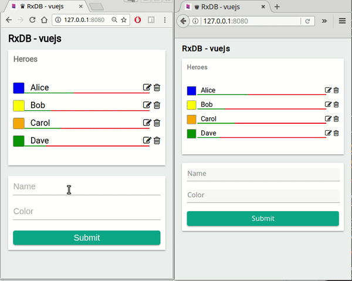

# NxDB vuejs example

This is an example usage of NxDB with VueJS. It implements a simple heroes-list which can be filled by the user.
For easier mapping of observables.

# Try it out
1. clone the whole [NxDB-repo](https://github.com/nxpkg/nxdb)
2. go into project `cd nxdb`
3. run `npm install && npm run build`
4. go to this folder `cd examples/vue`
5. run `npm run preinstall && npm install`
6. run `npm start`
7. Open [http://127.0.0.1:8080/](http://127.0.0.1:8080/) **IMPORTANT: do not use localhost**

